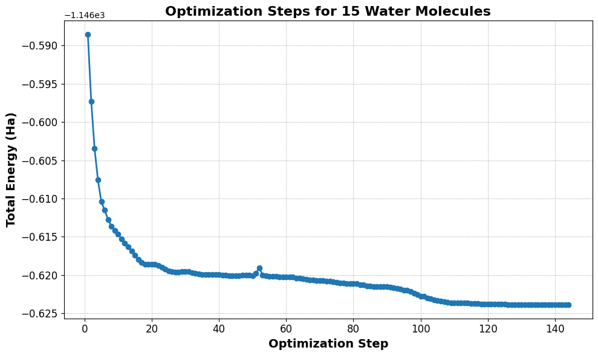
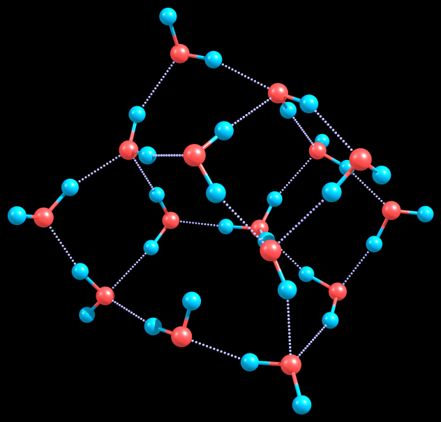
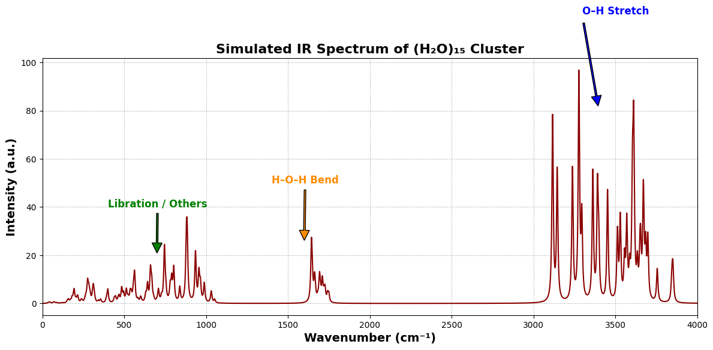
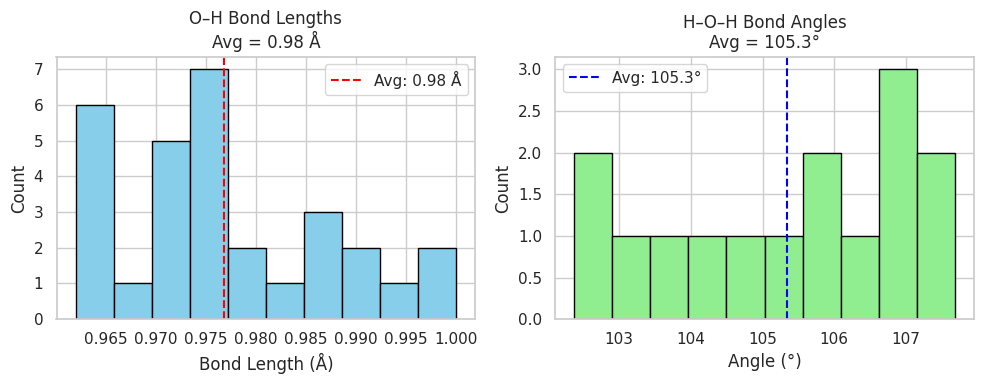

# Water Cluster (H₂O)₁₅: Geometry Optimization and Frequency Analysis

This folder contains DFT calculations of a 15-water molecule cluster using ORCA 6.0.0. The study includes geometry optimization, vibrational frequency analysis, and visualization of the structural and energetic results.

---

## Files

| File                              | Description |
|-----------------------------------|-------------|
| `opt_15h2o.inp`                   | Input file for geometry optimization |
| `opt_15h2o.out`                   | Output file for geometry optimization |
| `freq_15h2o.inp`                  | Input file for frequency calculation |
| `freq_15h2o.out`                  | Output file from frequency analysis |
| `15h2o_final.xyz`                 | Optimized structure (XYZ format) |
| `opt_energy_15h2o.png`            | Plot of total energy vs. optimization steps |
| `15h2o_cluster_optimized.jpg`     | Image of final cluster structure with hydrogen bonding |
| `ir_spectrum_15h2o_annotated.png` | Annotated IR spectrum from vibrational frequency analysis |
| `bond_stats_15h2o.png`            | Histogram of O–H bond lengths and H–O–H bond angles |

---

## Methodology

- **Software**: ORCA 6.0.0
- **Functional**: B3LYP with Grimme D4 dispersion correction
- **Basis Set**: def2-TZVP
- **SCF Criteria**: VeryTightSCF
- **Parallelization**: 8 cores, 9000 MB memory
- **Calculations**:
  - Geometry optimization
  - Harmonic vibrational frequency analysis
- **Environment**: Gas phase

---

## Results

### Energy Convergence

The following plot shows the total electronic energy throughout the optimization steps, confirming smooth convergence:

---

### Final Structure

The final optimized geometry forms an extensive hydrogen-bonding network typical of water clusters:

---

### Simulated IR Spectrum

The vibrational IR spectrum was generated from the frequency calculation results. Key functional group regions are annotated:

- **Libration / low-frequency modes** (~200–1000 cm⁻¹)
- **H–O–H bending** (~1600 cm⁻¹)
- **O–H stretching** (~3200–3700 cm⁻¹)

---

### Bond Length and Angle Analysis

The histograms below summarize the O–H bond lengths and H–O–H angles across the 15-water cluster. The values closely match typical experimental values for water (0.98 Å and 104.5–106°).

---

## Key Observations

- All vibrational frequencies are real, confirming a true local minimum (no saddle points).
- The final geometry is physically meaningful and chemically stable.
- Bond lengths and angles align well with experimental data for hydrogen-bonded water clusters.
- Suitable for further studies, including:
  - IR spectrum prediction and peak analysis
  - Thermodynamic property extraction
  - Comparison to experimental spectra

---

Created by [Handson Gisubizo](https://github.com/handsongisubizo)  
Contact: hgisubi1@jhu.edu
